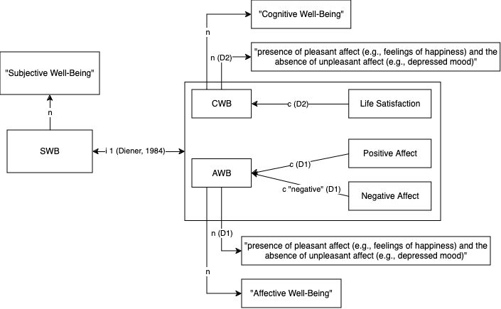
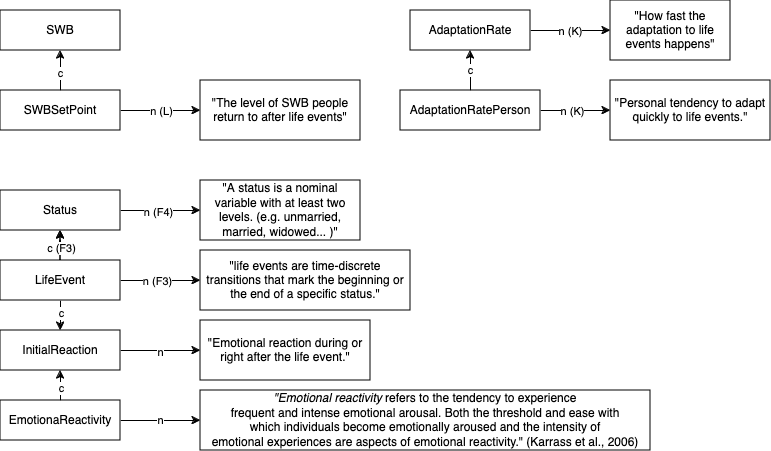
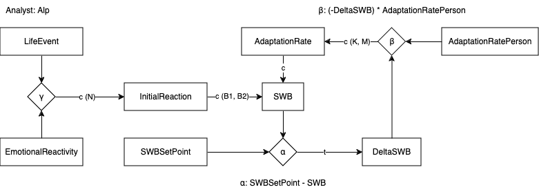

```{r setup, include = FALSE}
library("papaja")
r_refs("r-references.bib")

source("simulation/simulation.R")
```

```{r analysis-preferences}
# Seed for random number generation
set.seed(1256)
knitr::opts_chunk$set(cache.extra = knitr::rand_seed)
```


# Introduction

One of the most important questions we might attempt to answer is how to live our lives and what makes life good. Trying to maximize our happiness is the naive answer we easily arrive at, we want to feel good, and it is the self-evident reality all of us would agree on: being happy feels good. *Happiness* is an ambiguous word. Although it seems like all people tend to evaluate their lives and think about *happiness* [@veenhoven11HowUniversal2010], the understanding of *happiness*, its use and connotations vary across time and place [@oishiConceptsHappinessTime2013]. @dienerSubjectiveWellbeing1984 suggests the use of a scientific term: *subjective well-being* (SWB).

## Subjective Well-Being
According to @dienerSubjectiveWellbeing1984, SWB is the subjective global evaluation of life and consists of three components: (1) life satisfaction, (2) positive affect, (3) negative affect (see the *Constructs* section for a precise definition).

## The Phenomenon: Hedonic Treadmill

The observation, that people go back to a stable neutral level of SWB after (major) life events is not new. @helsonAdaptationlevelTheoryExperimental1964 formulated the more general Adaptation Level Theory, stating that how people perceive stimuli is influenced by their past experiences. @brickman1971adaptation applied this idea to SWB for the first time and coined the term *hedonic treadmill*, which is still commonly used to refer to the phenomenon of returning to a base SWB level after life events [e.g. @czaikaMigrationAspirationsAre2014; @manciniSteppingHedonicTreadmill2011], and @brickmanLotteryWinnersAccident provided first evidence for it. 

## Our Goal

We aim to formalize the *Set Point Theory of SWB* as described by @dienerHedonicTreadmillRevising2006a, which explains the phenomenon of hedonic treadmill and tries to account for individual differences.

# Robustness of the phenomenon

@luhmannSubjectiveWellbeingAdaptation2012 has done a meta-analysis on adaptation to life events focusing on SWB, they included 313 studies focusing on 8 different major life events. The total number of participants was 65911. Evaluating the robustness of the studies focusing on SWB and adaptation is difficult, since it is impossible to manipulate life events experimentally and cross-sectional studies have a lack of internal validity [@luhmannSubjectiveWellbeingAdaptation2012]. All of the following statements are based on the meta-analysis by @luhmannSubjectiveWellbeingAdaptation2012.

## Empirical Evidence

Studies focusing on the hedonic treadmill can not be adequately characterized by single effect sizes, since the temporal development of SWB is of interest. So @luhmannSubjectiveWellbeingAdaptation2012 used a method that takes time into account. For each life event, they fitted a logarithmic model using the effect sizes reported in original studies. An adaptation is characterized by a change parameter, which is in the opposite direction of the initial reaction. For example, having a positive reaction (higher SWB) after a life event, then a negative change in SWB, indicates that an adaptation is taking place.

Adaptations were observed for all life events, which means that the hedonic treadmill can be considered a robust phenomenon, but reduced internal validity due to the design of these studies makes it hard to evaluate.

## Generalizability

We evaluate the generalizability of the findings guided by the UTOS framework  [@cronbach1982designing]. A strict application of the UTOS framework to the phenomenon at hand is not possible because of the non-experimental nature of the studies.

### Units
In a lot of studies, the majority of the participants were females (65,4% across all events; for some life events like bereavement and divorce even 70+). More than half of the studies were from the US.

### Treatment
Studies focus on different major life events, 8 life events were included in the meta-analysis.

### Outcome
Using affective (AWB) and cognitive well being (CWB) measure (for some life events), studies used different measures for different variables, e.g. for the measurement of CWB in the context of marriage, relationship satisfaction was used.

### Setting
No clear statements are possible based on the meta-analysis.

Participants from diverse backgrounds are necessary for generalizability. Mixed (positive or negative) set of life event were analyzed, which is a good first sign for generalizability to different life events.

# The Theory

@dienerHedonicTreadmillRevising2006a evaluated the empirical findings from the last decades and expanded the model of hedonic treadmill, creating the *Set Point Theory of SWB*. They made 5 adjustments:

1. Set points can be non-neutral.
2. There are inter-individual differences in set points.
3. There are multiple set points: e.g. independent set  points for positive affect, negative affect or domain-specific well-being variables like work satisfaction, home satisfaction.
4. Individual set points of SWB can and do change over time.
5. There are inter-individual and intra-individual (based on the life event) differences in adaptation.

The general idea is that people have (genetically inherited to an extent) set points of SWB they return to after big changes in their lives. In this formalization, we are only going to take adjustments (1), (2) and (5) into account, since (3) and (4) add non-negligible complexity to the model, which is out of the scope of this project.

The visual representations of construct definitions and their relationships with each other according to the theory are done using VAST [@leisingVisualArgumentStructure2023]. 

## Constructs

The central constructs of the *Set Point Theory* are SWB, set point of SWB, life event, initial reaction and adaptation rate. We added the constructs emotional reactivity, and personal adaptation rate. The VAST displays for the construct definitions are shown below. 

### SWB



### Other relevant constructs



We made small changes to the theoretical model, in order to make it suitable for an implementation. 

@luhmannSubjectiveWellbeingAdaptation2012 clearly state that the adaptation after negative life events is slower. This would complicate the model and it is out of the scope of this project.

We also do not take anticipatory effects into account. SWB tends to change before major life events, if people know that something is going to happen. For example, before their marriage people can already anticipate their wedding, which leads to an increase in SWB. This is very well reflected in the empirical findings but it is not a part of the *Set Point Theory*.

Empirical findings show that AWB and CWB are affected separately by life events, their adaptations are also independent. @dienerHedonicTreadmillRevising2006a also have this in their models, as extension (3) but they do not state how separate well-being variables are affected by life events, how different their set points are, and what they change in the adaptation process.



```{r child="./material/variable_definitions.Rmd"}
```

\newpage

## Relationships between Constructs

### InitialReaction

The calculation of the initial reaction is based on the objective value of the life event and the emotional reactivity of the person.

$$\text{InitialReaction} = \text{LifeEvent} \times \text{EmotionalReactivity}$$
```{r}
# Define emotional reactivity sequence
emotional_reactivity_seq <- seq(0, 1, 0.2)

# Create a grid for plotting
par(mfrow = c(2, 3))  # 2 rows, 3 columns

# Plot the function for each emotional reactivity value
for (i in 1:length(emotional_reactivity_seq)) {
    emotional_reactivity <- emotional_reactivity_seq[i]
    life_events <- seq(-1, 1, length.out = 100)  # Generating life events in the range [-1, 1]
    reactions <- initial_reaction(life_events, emotional_reactivity)  # Calculating reactions
    plot(life_events, reactions, type = 'l', main = paste("EmotionalReactivity:", emotional_reactivity),
         xlab = "LifeEvent", ylab = "InitialReaction")
}
```

### DeltaSWB

DeltaSWB is simply the difference between the personal SWB set point and the current SWB.

$$\text{DeltaSWB} = \text{SWB} - \text{SWBSetPoint}$$

```{r}
# Define SWB_set_point sequence
SWB_set_points <- seq(0, 1, by = 0.2)

# Create a grid for plotting
par(mfrow = c(2, 3))  # 2 rows, 3 columns

# Plot the function for each SWB_set_point
for (i in 1:length(SWB_set_points)) {
    SWB_set_point <- SWB_set_points[i]
    SWB_values <- seq(0, 1, length.out = 100)  # Generating SWB values
    deltas <- delta_SWB(SWB_values, SWB_set_point)  # Calculating deltas
    plot(SWB_values, deltas, type = 'l', main = paste("SWBSetPoint:", SWB_set_point),
         xlab = "SWB", ylab = "DeltaSWB")
}
```

### Adaptation Rate

AdaptationRate is based on the interaction of DeltaSWB and AdaptationRatePerson. We want to have a logarithmic result at the end [@luhmannSubjectiveWellbeingAdaptation2012], using the current DeltaSWB for each iteration gives us exactly that. The adaptation should happen in the opposite direction of the InitialReaction, so we start by negating DeltaSWB (-DeltaSWB). According to @dienerHedonicTreadmillRevising2006a, there are individual differences in the adaptation rate, so we multiply the DeltaSWB based change with AdaptationRatePerson.

$$\text{AdaptationRate} = -\text{DeltaSWB} \times \text{AdaptationRatePerson}$$
```{r}
# Define adaptation_rate_person sequence
adaptation_rates <- seq(0, 1, by = 0.2)

# Create a grid for plotting
par(mfrow = c(2, 3))  # 2 rows, 3 columns

# Plot the function for each adaptation_rate_person value
for (i in 1:length(adaptation_rates)) {
    adaptation_rate_person <- adaptation_rates[i]
    delta_SWB_values <- seq(-1, 1, length.out = 100)  # Generating delta_SWB values
    rates <- adaptation_rate(delta_SWB_values, adaptation_rate_person)  # Calculating adaptation rates
    plot(delta_SWB_values, rates, type = 'l', main = paste("AdaptationRatePerson:", adaptation_rate_person),
         xlab = "DeltaSWB", ylab = "AdaptationRate")
}
```

### SWB

For the calculation of SWB, we just add AdaptationRate to the previous SWB value. We also limit the resulting values to the valid range for SWB, which is [0, 1].

$$
\text{SWB}_{\text{next}}(x) = \begin{cases} 
      0 & \text{if } (\text{SWB}_{\text{old}} + \text{AdaptationRate}) < 0 \\
      \text{SWB}_{\text{old}} + \text{AdaptationRate} & \text{if } 0 < (\text{SWB}_{\text{old}} + \text{AdaptationRate}) < 1 \\
      1 & \text{if } (\text{SWB}_{\text{old}} + \text{AdaptationRate}) > 1
\end{cases}
$$
```{r}
# Generate SWB sequence
SWB_values <- seq(0, 1, by = 0.2)

# Define adaptation_rate sequence
adaptation_rates <- seq(-1, 1, by = 0.2)

# Create a grid for plotting
par(mfrow = c(2, 3))  # 2 rows, 3 columns

# Plot the function for each adaptation_rate
for (i in 1:length(adaptation_rates)) {
    adaptation_rate <- adaptation_rates[i]
    SWB_result <- SWB(SWB_values, adaptation_rate)
    plot(SWB_values, SWB_result, type = 'l', main = paste("Adaptation Rate:", adaptation_rate),
         xlab = "SWB", ylab = "SWB with Adaptation")
}

```

# Simulation and Evaluation of the Model

We implemented the model using the programming language R [@R-base]. 

```{r include=FALSE}
source("simulation/simulation.R")
```

## Positive Life Events

We simulated the adaptation process of a person with an emotional reactivity of 0.5, an adaptation rate of 0.5 and a set point of 0.5. The objective value of the life event was set to 0.2. Following plot is a visualization of the adaptation process during the following 5 years after the event.

```{r positive_life_event}
person <- list(
  emotional_reactivity = 0.5,
  adaptation_rate = 0.5,
  SWB_set_point = 0.5
)

plot_single_person(person, 5, 0.2)
```

## Negative Life Events

We simulated the adaptation process of a person with an emotional reactivity of 0.5, an adaptation rate of 0.5 and a set point of 0.5. The objective value of the life event was set to -0.2. Following plot is a visualization of the adaptation process during the following 5 years after the event.

```{r negative_life_event}
person <- list(
  emotional_reactivity = 0.5,
  adaptation_rate = 0.5,
  SWB_set_point = 0.5
)

plot_single_person(person, 5, -0.2)
```

## Do People Return to the Same SWB after 5 Years?

```{r}
n <- 2000
years <- 5
life_event <- 0.2

results <- test_adaptation(n, years, life_event)
p <- results$p.value
```

We calculated a paired sample t-test with `r n` simulated persons. They experienced a life event with an objective value of `r life_event`. We compared the SWB values just before the event and after `r years` years.

$H_0$: Means of SWB values are the same before and `r years` after the event.

$H_1$: Means of SWB values are different before and `r years` after the event.

The t-test delivered a p-value of `r p`, which means that there are no differences in the SWB value before and 5 years after the event.


# Discussion

I think TCM and other approaches we had in general worked reasonably well for the Set Point Theory. But in order to be able to model all kinds of theories, we need a lot more tools than we had a chance to learn about during Empra. The Set Point Theory and Hedonic Treadmill were pushing the limits of the tools and frameworks we learned about. Because of the impossibility of experimental studies in this field of research, using our methodology for evaluating the robustness of the phenomenon was really hard. 

The hardest step for me was getting to understand the concepts. I had to read a lot in order to understand what it was all about. I would need a lot more time to really understand everything. The meta-analysis I chose also used more complex statistical methods than I am used to, I decided to use it without understanding everything. My theory paper was really clear about the revisions to the previous ideas and the meta-analysis had definitions in the constructs in it. But none of the papers I read describe the exact processes behind adaptation, so I had to add lots of new constructs like EmotionalReactivity or DeltaSWB to make it work as described in the papers I read.

One point I had problems with was defining constructs. "Do we have to define all words that are present in definitions" was an important questions. If you try to do it, it ends in an infinite regress, where we need more and more definitions. I decided to leave out definitions of "Positive Affect", "Negative Affect" and "Life Satisfaction". Defining "Life Satisfaction" would require a completely different literature review, I would happily go down the rabbit hole looking to understand life satisfaction, but it would be too much for this course.


\newpage

# References

::: {#refs custom-style="Bibliography"}
:::

# (APPENDIX) Appendix {-}

# Statements

```{r child="./material/statements.Rmd"}
```
